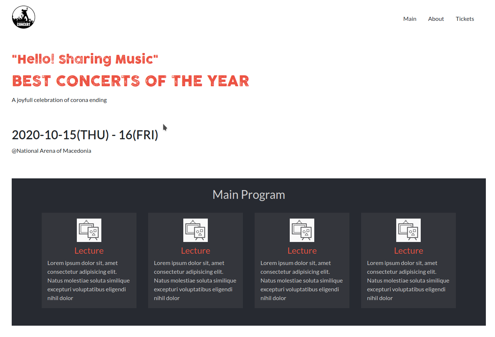

# Concer Site Project

> This project shows different ways that can help us make our website reponsive to all the screen sizes.

This is my 4th project in microverse where I designed a responsive concert website.

## Built With

- HTML
- CSS

## Framework

-Bootstrap 5

## Live Demo

[Live Demo Link](https://igorkol91.github.io/ConcertSite/)

## Getting Started

1. Clone the project 
  `$ git clone https://github.com/igorkol91/ConcertSite/`
2. Then open index.html in your browser

To get a local copy up and running follow these simple example steps.

### Prerequisites

Just ensure you have one or more web browsers

## Authors

:bust_in_silhouette: **Author1**

- GitHub: [@igorkol91](https://github.com/igorkol91)
- Twitter: [@Destro49536502]
- LinkedIn: [LinkedIn](https://linkedin.com/in/linkedinhandle)

## Design idea by [Cindy Shin in Behance](https://www.behance.net/adagio07)

## :handshake: Contributing

Contributions, issues, and feature requests are welcome!
Feel free to contribute 

## Show your support

Give a ⭐️ if you like this project!

